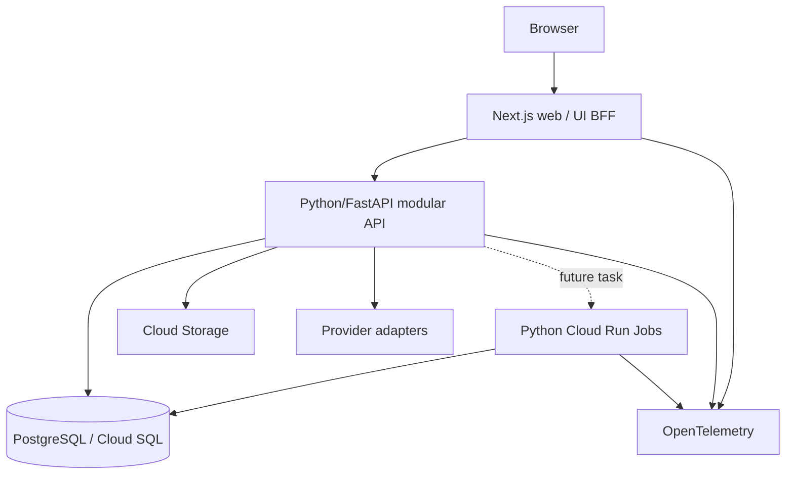

# C4 containers

```mermaid
flowchart TB
  browser["Browser"] --> web["Next.js web / UI BFF"]
  web --> api["Python/FastAPI modular API"]
  api --> db[("PostgreSQL / Cloud SQL")]
  api --> storage["Cloud Storage"]
  api --> providers["Provider adapters"]
  jobs["Python Cloud Run Jobs"] --> db
  api -. "future task" .-> jobs
  web --> telemetry["OpenTelemetry"]
  api --> telemetry
  jobs --> telemetry
```
