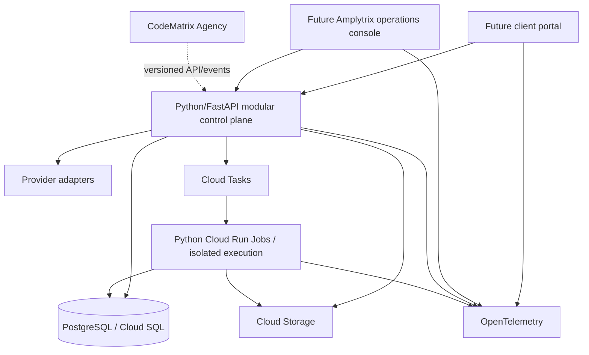

# C4 containers

```mermaid
flowchart TB
  client["Future client portal"] --> api["Python/FastAPI modular control plane"]
  ops["Future Amplytrix operations console"] --> api
  api --> db[("PostgreSQL / Cloud SQL")]
  api --> storage["Cloud Storage"]
  api --> providers["Provider adapters"]
  api --> tasks["Cloud Tasks"]
  tasks --> jobs["Python Cloud Run Jobs / isolated execution"]
  jobs --> db
  jobs --> storage
  agency["CodeMatrix Agency"] -. "versioned API/events" .-> api
  client --> telemetry["OpenTelemetry"]
  ops --> telemetry
  api --> telemetry
  jobs --> telemetry
```

Only the existing `apps/web` health scaffold exists today. The diagram shows target boundaries, not
authorization to create deployables, providers, or cloud resources.
