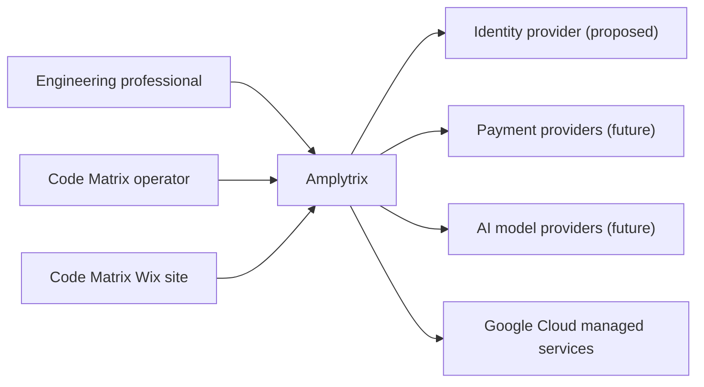

# C4 context

```mermaid
flowchart LR
  user["Engineering professional"] --> amp["Amplytrix"]
  admin["Code Matrix operator"] --> amp
  amp --> identity["Identity provider (proposed)"]
  amp --> payment["Payment providers (future)"]
  amp --> model["AI model providers (future)"]
  amp --> gcp["Google Cloud managed services"]
  wix["Code Matrix Wix site"] --> amp
```
