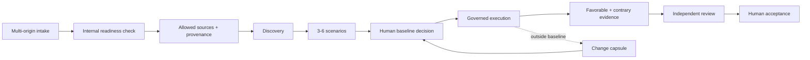
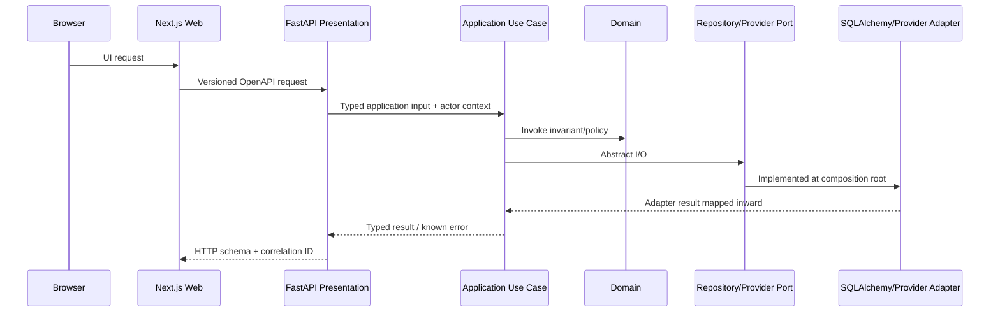

# Phase Zero project method

```mermaid
flowchart LR
  IN["Multi-origin intake"] --> READY["Internal readiness check"]
  READY --> SOURCES["Allowed sources + provenance"]
  SOURCES --> DISC["Discovery"]
  DISC --> SCEN["3-6 scenarios"]
  SCEN --> HUMAN["Human baseline decision"]
  HUMAN --> EXEC["Governed execution"]
  EXEC --> EVID["Favorable + contrary evidence"]
  EVID --> REVIEW["Independent review"]
  REVIEW --> ACCEPT["Human acceptance"]
  EXEC -. "outside baseline" .-> CAPSULE["Change capsule"]
  CAPSULE --> HUMAN
```

## Future runtime dependency and request flow

```mermaid
sequenceDiagram
  participant Browser
  participant Next as Next.js Web
  participant HTTP as FastAPI Presentation
  participant App as Application Use Case
  participant Domain
  participant Port as Repository/Provider Port
  participant Adapter as SQLAlchemy/Provider Adapter
  Browser->>Next: UI request
  Next->>HTTP: Versioned OpenAPI request
  HTTP->>App: Typed application input + actor context
  App->>Domain: Invoke invariant/policy
  App->>Port: Abstract I/O
  Port->>Adapter: Implemented at composition root
  Adapter-->>App: Adapter result mapped inward
  App-->>HTTP: Typed result / known error
  HTTP-->>Next: HTTP schema + correlation ID
```
