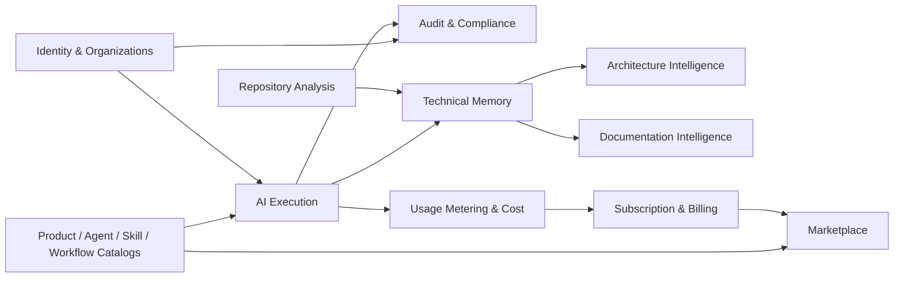

# Candidate context map

```mermaid
flowchart LR
  IAM["Identity & Organizations"] --> GOV["Audit & Compliance"]
  CAT["Product / Agent / Skill / Workflow Catalogs"] --> EXEC["AI Execution"]
  IAM --> EXEC
  EXEC --> MEM["Technical Memory"]
  MEM --> ARCH["Architecture Intelligence"]
  MEM --> DOC["Documentation Intelligence"]
  REPO["Repository Analysis"] --> MEM
  EXEC --> USAGE["Usage Metering & Cost"]
  USAGE --> BILL["Subscription & Billing"]
  CAT --> MARKET["Marketplace"]
  BILL --> MARKET
  EXEC --> GOV
```

External identity, payment, model and source-control systems require Anti-Corruption Layers. Events are conceptual initially; no distributed bus is implied.
